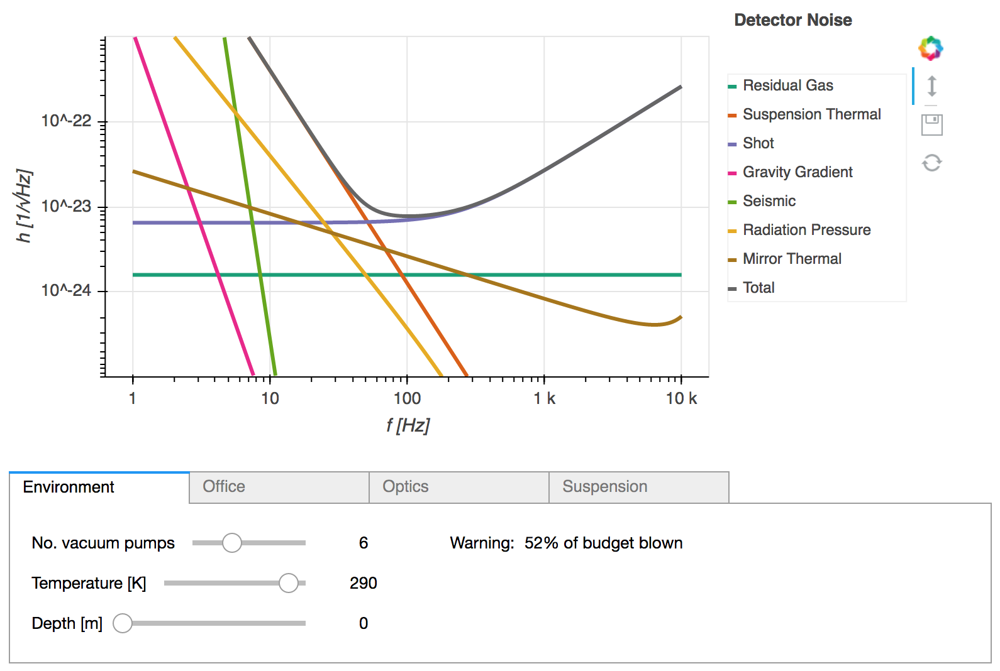

# Space Py Quest 1.0.0

Space Py Quest is a gravitational wave interferometer parameter optimisation game, written in Python and run in a Jupyter notebook. 
It is based on the original game Space Time Quest, available as apps for iOS, Android, Windows, Linux and MacOs
at <a href="https://www.laserlabs.org/spacetimequest.php">https://www.laserlabs.org/spacetimequest.php</a>. Both versions of the game can be used for teaching and public engagement. The apps are easy to use and provide a playful way to introduce detector design and technology. This Python version allows students to also look into the underlying noise models.

Space Py Quest is played from a Jupyter notebook that consists of a single plot displaying multiple noise curves and the detector sensitivity. By modifying the detector's physical properties, the user can change the noise and sensitivity and thus design their own detector. A drop-down menu provides access to controls for the interferometer's variable parameters. Additional controls are available for adjusting the limits of the x- and y-axes, and for adding and removing individual noise curves from the total calculation.



The Science Run option tool is a button, which returns a 'Score': the complexity and cost of the instrument; the number of detections for  Supernova, Black Hole binaries and Neutron Star binaries; the range to which the detector can sense binary system mergers; and the weighted total observation range of the detector. Note that the scoring algorithm in Space Py Quest is not identical to the one used in Space Time Quest, so that this code cannot be trivially used to get the top score in the [Space Time Quest leader board](https://www.laserlabs.org/stq_highscore/index.php?v=1.5).

There are slightly more complex ways of interacting with the game. Space Py Quest allows the user to add their own noise models if they wish, using the ScoreCalculator class's SetNoiseModels function, which is held in score.py. The new models can be written into a script, as examplified in userDefinedNoise.py. Alternatively, they can be automatically generated using functions defined in translate.py.

## Prerequisites
Space Py Quest should be run with Python versions at or above 3.5.4, and with the Bokeh package at version 0.12.9 or above. 

## Installing
There are several ways to install the required software packages and Space Py Quest. Experienced Python users can download the files from the repository and start the Jupyter notebook [SpacePyQuest.ipynb](SpacePyQuest.ipynb).

It is now possible to install the core module for Space Py Quest without downloading all of the files in this repository. If you have [Anacoda](https://www.anaconda.com/) installed, simply type

`conda install -c isobelmarguarethe pystq` 

into the command prompt.

Below we provide some suggestions for installing the required Python packages for less experienced users. Based on previous work with diverse groups of people, for example, such as during summer schools, we recommend the use of [Anacoda](https://www.anaconda.com/), which is cross platform, well documented and provides an easy to install and well managed Python environment.

### Example 1: I do not have Anaconda
(If this does not apply to you, skip to Example 2.) Download either Miniconda or the full Anaconda package. Miniconda is quicker to install and perfectly adequate for the purposes of Space Py Quest, while Anaconda would be preferable if you use Python for other purposes as well. To download and install Miniconda, follow the instructions here: [https://conda.io/miniconda.html].
The download page for Anaconda is available here: [https://www.anaconda.com/download/]. Ensure that you are installing Python versions at or above 3.5.4.

See also the [Anaconda user guide](https://conda.io/docs/user-guide/install/download.html) for more advice on chosing between Anaconda and Miniconda.

### Example 2: I do not have Jupyter
Open an Anaconda or Miniconda terminal. You can check that you are running a Python version at or above 3.5.4. by typing ```python --version```. If you are not, run ```conda update python``` first.
Run the command ```conda install jupyter``` to install Jupyter. You will need to confirm the install by pressing 'y' when prompted.

### Example 3: I do not have Bokeh
Bokeh is an interactive graphics library for Python. To install this, open a command window and run ```conda install bokeh```.

### Example 4: I have all aforementioned packages
Great! Open a command window and navigate to the SpacePyQuest folder. Run the command ```jupyter notebook SpacePyQuest.ipynb```.

## Authors
This project was created by Philip Jones and Isobel Romero-Shaw, with support from Roshni Vincent and Andreas Freise. The code has been generated from the original game Space Time Quest with permission.

## License
This project is licensed under the GNU General Public License 3 - see the [gpl-3.0.md](gpl-3.0.md) file for details

